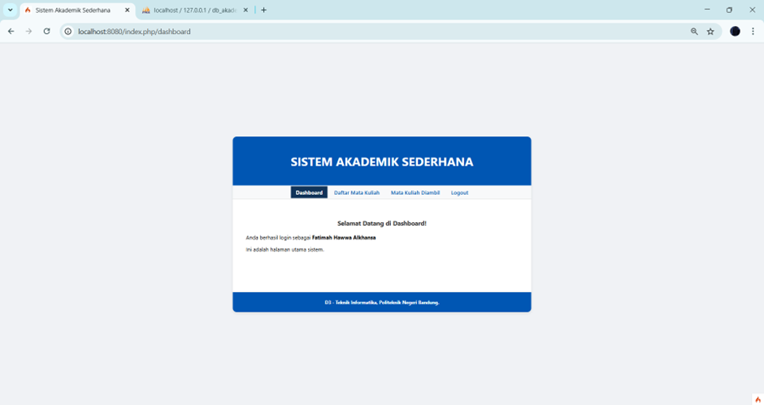

# Proyek-3
Pengembangan Perangkat Lunak Berbasis Web

# Sistem Akademik Sederhana

Proyek ini adalah implementasi sistem akademik sederhana yang dikembangkan menggunakan framework CodeIgniter 4. Aplikasi ini berfokus pada penerapan Authentication dan Authorization, serta meningkatkan interaktivitas antarmuka pengguna dengan JavaScript.

---

## Penjelasan Singkat Fitur

Aplikasi ini memiliki dua peran pengguna utama, yaitu **Admin/Operator** dan **Mahasiswa**, dengan fitur-fitur sebagai berikut:

### Fitur Admin
* **Manajemen Mahasiswa**: Admin memiliki hak penuh untuk menambah, melihat detail, mengedit, dan menghapus data mahasiswa (operasi CRUD).
* **Manajemen Mata Kuliah**: Admin memiliki hak penuh untuk menambah, melihat detail, mengedit, dan menghapus data mata kuliah (operasi CRUD).
* **Validasi Input**: Form pendaftaran mahasiswa dan mata kuliah memiliki validasi di sisi klien menggunakan JavaScript, dengan pesan error dan visualisasi yang jelas.

### Fitur Mahasiswa
* **Daftar Mata Kuliah**: Mahasiswa dapat melihat daftar mata kuliah yang tersedia.
* **Enrollment Interaktif**: Mahasiswa dapat memilih lebih dari satu mata kuliah menggunakan checklist. Total SKS akan terhitung secara dinamis di sisi klien.
* **Validasi Enroll**: Sistem mencegah Mahasiswa mengambil mata kuliah yang sama lebih dari satu kali.
* **Mata Kuliah Diambil**: Mahasiswa dapat melihat daftar mata kuliah yang telah mereka ambil.

### Fitur Umum
* **Autentikasi & Otorisasi**: Sistem menggunakan session untuk mengelola login dan logout. Hak akses pengguna diatur berdasarkan peran (role) menggunakan middleware.
* **Interaktivitas JS**: Sebagian besar interaksi form dan konfirmasi dijalankan di sisi klien menggunakan DOM Manipulation dan Event Handling, tanpa memuat ulang halaman.

---

## Teknologi yang Digunakan

* **Backend**: CodeIgniter 4 dan PHP
* **Database**: MySQL
* [cite_start]**Frontend**: HTML, CSS Kustom, dan JavaScript [cite: 286, 287, 288]
* [cite_start]**Library**: `session` dari CodeIgniter 4 untuk autentikasi [cite: 147]

---

## Screenshot Hasil Uji Coba

### 1. Autentikasi & Akses Kontrol
* **Halaman Login**: 

Tangkapan layar ini menunjukkan tampilan halaman login. Navbar hanya menampilkan "Halaman Login" yang membuktikan aplikasi mengenali pengguna yang belum terautentikasi.
* **Dashboard Admin**: 

Menunjukkan tampilan dashboard setelah login sebagai Admin. Navbar menampilkan menu lengkap seperti "Manajemen Mahasiswa" dan "Manajemen Mata Kuliah", membuktikan otorisasi untuk peran Admin.
* **Dashboard Mahasiswa**: 

Menunjukkan tampilan dashboard setelah login sebagai Mahasiswa. Navbar yang ditampilkan berbeda, hanya menyertakan menu seperti "Daftar Mata Kuliah", yang menunjukkan pembatasan akses untuk peran Mahasiswa.
* **Proteksi Halaman**: 

Tangkapan layar yang menunjukkan pesan "403 Unauthorized" saat Mahasiswa mencoba mengakses URL halaman Admin secara langsung, membuktikan bahwa middleware bekerja.

### 2. Fitur Admin (CRUD)
* **Manajemen Mahasiswa**: 

Tampilan tabel data mahasiswa yang diambil dari database, dengan tombol "View", "Edit", dan "Hapus" yang berfungsi.
* **Validasi Form**: 

Tampilan form saat dikirim dengan field kosong. Menunjukkan validasi JavaScript berfungsi, dengan border merah dan pesan error.
* **Konfirmasi Hapus**: 

Tampilan dialog konfirmasi yang muncul setelah tombol "Hapus" ditekan, memberikan kesempatan kepada pengguna untuk membatalkan aksi.

### 3. Fitur Mahasiswa
* **Daftar Mata Kuliah**: 

Tampilan halaman "Daftar Mata Kuliah" yang menampilkan checklist mata kuliah yang di-render secara dinamis oleh JavaScript.
* **Penghitungan SKS**: 

Tampilan total SKS terhitung secara otomatis saat beberapa mata kuliah dicentang, membuktikan event handling dan DOM manipulation berjalan dengan baik.
* **Mata Kuliah Diambil**: 

Tampilan halaman "Mata Kuliah Diambil" yang menunjukkan daftar mata kuliah yang sudah berhasil di-enroll.
* **Pesan "Semua Sudah Diambil"**: 

Tampilan halaman "Daftar Mata Kuliah" yang menunjukkan pesan bahwa semua mata kuliah sudah diambil, dan tidak ada lagi checklist yang ditampilkan.